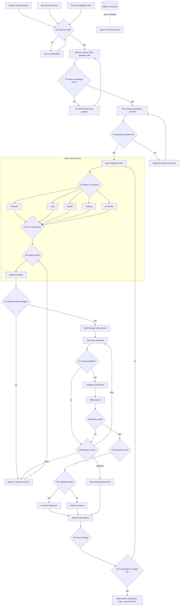

# Detailed ML Flow and Agent Decision Map


Related documents:

- [System architecture](../architecture.md)
- [Recommender-system ML workflow](../ML.md)

## 1. The short answer

The main agent tuning process is the purple loop in the flowchart:

```text
Evidence → D3 choose where to improve
         → D4 form a testable hypothesis
         → D5 design the experiment/search
         → deterministic training and scoring
         → D10 interpret the result
         → D12 choose explore/exploit/ensemble
         → updated evidence → repeat
```

The agent should make **research decisions**. Deterministic code should make **validity decisions**.

Give the agent these decisions:

- Which pipeline stage is the current bottleneck.
- Which feature, loss, model, training, sampling, or ensemble hypothesis to test.
- Which bounded hyperparameter search space is scientifically justified.
- How to interpret the metric and segment changes.
- Whether the next experiment should exploit, explore, revise, or ensemble.
- Which safe recovery path to request after a failure.

Do not give the agent these decisions:

- Whether data alignment or metric output is valid.
- Whether the official scorer or split should change.
- Whether hidden-test labels may be accessed.
- Whether a checkpoint is numerically the validation best.
- Whether hard iteration/time/convergence limits apply.
- Whether malformed predictions should be accepted.

## 2. Decision ownership

| ID | Decision | Owner | Why |
| --- | --- | --- | --- |
| D0 | Is the problem contract complete and internally consistent? | Deterministic validation; human resolves ambiguity | The agent must not invent the scored task |
| D1 | Is the data valid and leakage-safe? | Deterministic checks; Data Analyst explains failures | Leakage rules are hard constraints |
| D2 | Was the official baseline reproduced? | Deterministic score comparison | The experimentation harness must be trusted first |
| **D3** | **Where should the system improve next?** | **Agent: Research Planner** | Requires judgment across data, features, loss, model, training, and ensemble |
| **D4** | **What hypothesis explains the expected improvement?** | **Agent: Research Planner** | Requires reasoning and research synthesis |
| **D5** | **What experiment and search space should test it?** | **Agent: ML Engineer/Planner** | Requires selecting controlled variables, ranges, and success criteria |
| D6 | Is the candidate safe and within budget? | Deterministic Policy/Safety Gate | Security and budgets are not negotiable |
| D7 | Is training healthy? | Deterministic monitors | NaN, timeout, memory, heartbeat, and artifact checks are objective |
| **D8** | **Which permitted recovery is appropriate?** | **Agent: Reliability Guardian** | Failure classification may require contextual judgment |
| D9 | Are predictions and metrics valid? | Deterministic Scorer Wrapper | Row alignment and official metric calculation must be exact |
| **D10** | **Why did performance change and what was learned?** | **Agent: Evaluator/Reflector** | Requires causal hypotheses and segment-level interpretation |
| D11 | Is this the validation-best checkpoint? | Deterministic Registry | A numeric promotion rule prevents cherry-picking |
| **D12** | **Should the next move exploit, explore, revise, or ensemble?** | **Agent: Orchestrator/Reflector** | Requires portfolio-level research strategy |
| D13 | Has convergence or a hard budget been reached? | Deterministic Budget Controller | Challenge limits must be enforced exactly |

The core tuning agent operates at **D3 + D4 + D5**. D10 and D12 close the learning loop. D8 is a specialized failure path.

## 3. Full workflow



## 4. What to input to the tuning agent

Do not prompt the agent with only “improve the score.” Send a structured `EvidencePack` containing verified facts.

### 4.1 EvidencePack

```json
{
  "run": {
    "run_id": "run_2026_08_28_001",
    "iteration": 6,
    "elapsed_seconds": 1540,
    "remaining_iterations": 44,
    "remaining_seconds": 20060
  },
  "problem": {
    "task": "within-user ranking over logged impressions",
    "label": "long_view",
    "metrics": ["GAUC", "nDCG@5"],
    "primary": "mean(GAUC, nDCG@5)",
    "baseline_primary": 0.6016,
    "protected_files": ["evaluate.py", "benchmark split config"],
    "hidden_test_access": false
  },
  "incumbent": {
    "experiment_id": "exp_004",
    "model": "lightgbm_lambdarank",
    "GAUC": 0.6721,
    "nDCG@5": 0.5430,
    "primary": 0.60755,
    "runtime_seconds": 118,
    "peak_memory_mb": 920
  },
  "data_summary": {
    "rows": {"train": 1141112, "valid": 124909},
    "positive_rate": {"train": 0.0, "valid": 0.0},
    "cold_start": {},
    "drift": [],
    "leakage_audit": "pass"
  },
  "error_summary": {
    "weak_segments": [],
    "metric_tradeoffs": [],
    "training_signals": []
  },
  "recent_experiments": [],
  "dead_ends": [
    "blind FM embedding-size expansion",
    "indiscriminate static feature expansion"
  ],
  "available_components": {
    "feature_builders": [],
    "models": ["fm", "bpr_fm", "lightgbm_lambdarank", "deepfm"],
    "losses": ["binary_cross_entropy", "bpr", "lambdarank"],
    "samplers": ["within_user_uniform", "within_user_hard"]
  }
}
```

The placeholder `0.0` fields must be filled by deterministic analysis code. The agent must never estimate or invent dataset facts.

### 4.2 What not to include

Exclude:

- Hidden-test labels or hidden-test metrics.
- Full raw datasets in the LLM context.
- API secrets or unrelated environment variables.
- Unbounded repository write permissions.
- Metric values copied from an unverified agent response.
- Entire historical logs when a compact registry summary is sufficient.

## 5. D3 — choose where to improve

### Agent role

`Research Planner`

### Agent input

- Current `EvidencePack`.
- Feature/model component catalog.
- Last successful and failed experiments.
- Segment-level weakness report.
- Remaining resource budget.
- Relevant papers or an approved research tool.

### Agent task

Choose one bottleneck:

```text
data quality
feature representation
training objective
negative sampling
model architecture
optimization / regularization
multi-task weighting
temporal validation
ensemble
```

The agent should prefer an experiment that is:

- Likely to improve the primary metric.
- Informative even if it fails.
- Different from known dead ends.
- Small enough to complete inside the remaining budget.
- Isolatable as one main change.

### Required output

```json
{
  "decision_id": "dec_007_d3",
  "selected_stage": "loss",
  "bottleneck": "Pointwise FM loss is misaligned with within-user ranking",
  "evidence": [
    "GAUC remains weaker than expected in mixed-label users",
    "current objective treats impressions independently"
  ],
  "alternatives_rejected": [
    {
      "stage": "model_capacity",
      "reason": "Prior embedding-size ablation showed no useful gain"
    }
  ],
  "confidence": 0.72
}
```

The confidence is the agent's estimate, not a probability used as ground truth.

## 6. D4 — form a hypothesis

A valid hypothesis connects a cause, a controlled change, and an observable result.

Bad:

```text
Try BPR because it is popular.
```

Good:

```text
Because evaluation compares item order within each user, replacing pointwise
cross-entropy with within-user BPR pairs should improve GAUC and may improve
nDCG@5, especially for users with both positive and negative impressions.
```

### Required output

```json
{
  "hypothesis_id": "hyp_007",
  "statement": "Within-user BPR will better align FM training with ranking metrics",
  "change_type": "loss",
  "controlled_variable": "loss and sampling only",
  "kept_constant": [
    "five baseline feature fields",
    "embedding dimension 16",
    "data split",
    "evaluation code"
  ],
  "expected_result": {
    "primary_delta_range": [0.002, 0.008],
    "most_likely_metric": "GAUC",
    "most_likely_segment": "mixed-label users"
  },
  "risks": [
    "few pairs for users with homogeneous labels",
    "hard-negative sampling may overfit"
  ],
  "success_rule": "primary > incumbent + 0.002",
  "falsification_rule": "no gain across two seeds or GAUC gain is offset by nDCG loss"
}
```

The falsification rule is important: it prevents the agent from rewriting the explanation after seeing the result.

## 7. D5 — design the experiment and tuning search

This is where the agent decides **what to tune**. A deterministic tuner should decide the exact numeric trials.

### Correct division of work

| Decision | Agent | Tuner/runner |
| --- | ---: | ---: |
| Choose model family | Yes | No |
| Choose feature family | Yes | No |
| Choose loss and sampler | Yes | No |
| Choose parameter names to tune | Yes | No |
| Choose safe ranges/distributions | Yes | Validate bounds |
| Choose exact next numeric trial | No | Yes |
| Run trials | No | Yes |
| Compute metrics | No | Yes |
| Interpret the completed search | Yes | No |

Do not spend one LLM call selecting every learning rate. That is slower, less reproducible, and more expensive than random, successive-halving, or Bayesian search.

### ExperimentSpec

```yaml
experiment_id: exp_007
hypothesis_id: hyp_007
change_type: loss
base_artifact: exp_004

pipeline:
  feature_set: baseline_5_fields
  model: bpr_fm
  sampler: within_user_pair
  evaluator: official

fixed:
  embedding_dim: 16
  split: official_temporal
  label: long_view
  seed: 7

search:
  strategy: bounded_bayesian
  max_trials: 6
  objective: validation_primary
  parameters:
    learning_rate:
      distribution: log_uniform
      low: 0.0001
      high: 0.01
    l2:
      distribution: log_uniform
      low: 0.0000001
      high: 0.001
    negatives_per_positive:
      values: [1, 2, 4]
    sampler:
      values: [uniform, semi_hard]

resources:
  max_trial_seconds: 300
  max_total_seconds: 1500
  max_memory_mb: 4096

acceptance:
  smoke_test: required
  finite_predictions: required
  exact_row_alignment: required
  minimum_primary: 0.60955
```

### Search rules

- Use a **single configuration** for a clean scientific ablation.
- Use **bounded HPO** after the new component has passed one reasonable configuration.
- Use a **code patch** only when no registered component represents the hypothesis.
- Define ranges from model behavior and previous curves, not generic huge bounds.
- Keep the number of simultaneously changed concepts small.
- Record every attempted configuration, including failed trials.

Every full training configuration that queries official validation must be visible in iteration/resource accounting. Cheap inner-fold trials can be nested inside one hypothesis, but their time and results must still be logged.

## 8. Tunable parameter catalog

### 8.1 Feature decisions

| Family | Agent may choose | Hard guardrails |
| --- | --- | --- |
| Historical aggregates | Windows, smoothing, entity pairs | Training prefix/out-of-fold only |
| Recency | Time decay and window sizes | Timestamps strictly before prediction |
| User preference | Category/author/duration affinity | No current-row outcomes |
| Popularity/trend | Entity and time horizon | Fit on permitted history only |
| Sequence | Event types, length, pooling/attention | Ordered, masked, no future events |
| Side information | Safe static fields and encoding | Audit time range and missing values |
| Cross features | User/item/context interactions | Must change within-user ordering |

### 8.2 Objective decisions

- Pointwise binary cross-entropy.
- Pairwise BPR within user.
- Listwise softmax within candidate group.
- LambdaRank/XENDCG with nDCG cutoff alignment.
- Multi-task loss composition.
- Watch-time auxiliary regression or censoring treatment.
- Class, pair, and task weighting.

The agent can choose the objective and weight ranges. The official validation scorer remains fixed.

### 8.3 Model decisions

- FM/BPR-FM.
- LightGBM LambdaRank/XENDCG.
- DeepFM or another feature-interaction model.
- Shared-bottom multi-task model.
- MMoE when task interference is observed.
- DIN-style candidate-aware history.
- SASRec-style sequential representation.
- Rank-normalized ensemble.

The agent should justify the next level using a measured bottleneck. “More complex” is not a sufficient reason.

### 8.4 Training decisions

- Learning-rate range and scheduler family.
- L2, dropout, embedding dimension, and layer width within bounds.
- Batch size compatible with memory.
- Gradient clipping.
- Pair/negative sampling strategy.
- Maximum epochs and model-internal patience.
- Task weights.
- Number of confirmation seeds.

The deterministic controller retains ownership of total runtime, iteration cap, process timeout, and run-level convergence.

### 8.5 Ensemble decisions

- Candidate members selected from validation-diverse winners.
- Score normalization: percentile/rank, z-score within user, or calibrated blend.
- Weight ranges.
- Segment-aware blends only when they can be justified without overfitting.

Never ensemble test predictions based on test feedback.

## 9. D6, D7, D9, D11, and D13 — deterministic gates

These are intentionally not agent tuning points.

### D6 safety and budget

Checks:

- Experiment schema parses.
- Protected files are unchanged.
- Data and metric contracts are unchanged.
- Code compiles and unit tests pass.
- Small-data smoke run finishes.
- Estimated job fits remaining time, memory, and iteration budget.

### D7 training health

Checks:

- Process heartbeat is current.
- Loss, gradients, weights, and predictions remain finite.
- Training is not stuck or diverging.
- Checkpoints can be written and loaded.
- Runtime and memory remain inside limits.

### D9 metric integrity

Checks:

- Prediction row count equals validation row count.
- Row IDs and user/item alignment match.
- All scores are numeric and finite.
- Official evaluator hash is unchanged.
- Metrics come from the evaluator output, not agent-authored text.

### D11 promotion

```python
if candidate.primary > incumbent.primary:
    promote(candidate.checkpoint)
else:
    retain(incumbent.checkpoint)
```

Promotion and convergence are separate. A `+0.001` candidate becomes the validation best, but it does not reset the `epsilon = 0.002` convergence counter.

### D13 convergence and budget

Stop on the first of:

- Three consecutive completed results without improvement greater than `0.002`.
- 50 launched experiments.
- Six hours total agent wall-clock.

Always finalize the validation-best artifact, not the last model.

## 10. D8 — agent-guided failure recovery

The Reliability Guardian receives a sanitized `FailureEvent`:

```json
{
  "experiment_id": "exp_007",
  "stage": "training",
  "failure_type": "out_of_memory",
  "exit_code": 1,
  "last_heartbeat_seconds_ago": 2,
  "peak_memory_mb": 4096,
  "configured_memory_mb": 4096,
  "last_checkpoint": "epoch_3",
  "retry_count": 0,
  "allowed_recoveries": [
    "reduce_batch_size",
    "enable_gradient_accumulation",
    "resume_checkpoint",
    "abandon"
  ],
  "log_excerpt": "bounded sanitized error excerpt"
}
```

Required response:

```json
{
  "action": "reduce_batch_size",
  "reason": "Memory reached the hard limit before optimizer step",
  "parameter_delta": {"batch_size": {"from": 8192, "to": 4096}},
  "resume_from": "epoch_3",
  "changes_hypothesis": false,
  "retry": true
}
```

Rules:

- The agent may select only from `allowed_recoveries`.
- A recovery may not weaken scorer, split, or hidden-test protections.
- If the recovery changes the scientific hypothesis, register it as a new experiment.
- Repeating the same recovery after the same failure is prohibited.

## 11. D10 — result interpretation

The evaluator/reflector agent receives only verified results.

### EvaluationPacket

```json
{
  "hypothesis": {},
  "candidate": {
    "GAUC": 0.6750,
    "nDCG@5": 0.5410,
    "primary": 0.6080
  },
  "incumbent": {
    "GAUC": 0.6721,
    "nDCG@5": 0.5430,
    "primary": 0.60755
  },
  "baseline": {
    "GAUC": 0.6674,
    "nDCG@5": 0.5357,
    "primary": 0.6016
  },
  "uncertainty": {
    "seed_count": 1,
    "known_baseline_std": 0.0008
  },
  "segment_deltas": [],
  "training_curves": {},
  "prediction_diagnostics": {},
  "cost": {
    "training_seconds": 130,
    "peak_memory_mb": 840,
    "llm_tokens": 2200
  }
}
```

### Required reflection

```json
{
  "hypothesis_status": "partially_supported",
  "summary": "Pairwise training improved GAUC but reduced nDCG@5",
  "evidence": [],
  "likely_mechanism": "Better global positive-negative ordering without enough top-5 focus",
  "possible_confounds": ["single seed"],
  "acceptance_recommendation": "promote_if_numeric_rule_allows",
  "next_questions": [
    "Would semi-hard negatives recover nDCG@5?",
    "Would a listwise top-5 objective preserve the GAUC gain?"
  ]
}
```

The agent interprets promotion; it does not control it. D11 applies the numeric rule.

## 12. D12 — portfolio strategy

The next experiment should not always be a small variation of the latest winner.

### Exploit

Choose when:

- A new component produced a meaningful gain.
- Training curves show obvious under/over-regularization.
- A small targeted search is likely to capture more value.

Examples:

- Tune negative sampling after BPR succeeds.
- Tune LambdaRank cutoff after a ranker improves nDCG.
- Tune two task weights after multi-task learning shows transfer.

### Explore

Choose when:

- Recent local variations plateau.
- Segment evidence points to a new bottleneck.
- Remaining budget can support a different model family.

Examples:

- Move from static aggregates to candidate-aware user history.
- Try temporal weighting after detecting date drift.
- Try multi-task learning after sparse long-view segments fail.

### Revise

Choose when the original idea remains plausible but the experiment did not isolate it correctly.

Example: BPR failed because uniform sampling produced mostly easy negatives; revise the sampler without changing the representation.

### Ensemble

Choose when:

- Two strong models improve different metrics or segments.
- Their within-user score orderings are not almost identical.
- There is enough validation budget to fit blend weights without excessive overfitting.

### StrategyDecision

```json
{
  "strategy": "exploit",
  "reason": "BPR improved GAUC and the loss family has not been tuned",
  "next_stage": "negative_sampling",
  "next_hypothesis": "Semi-hard within-user negatives will focus training near the decision boundary",
  "estimated_experiments": 3,
  "estimated_seconds": 600,
  "fallback": "Explore listwise LightGBM if all three trials fail"
}
```

D13 still decides whether this recommendation may run.

## 13. Recommended agent topology

For the first implementation, do not deploy six independent agent services. Use one LLM gateway with three logical roles:

```text
Research Planner    → D3, D4, D5, D12
Evaluator/Reflector → D10
Reliability Guardian→ D8
```

The Orchestrator is normal code that invokes the roles and advances the state machine. When the system is stable, the Research Planner can be split into Data Analyst, Researcher, and ML Engineer roles without changing the contracts.

## 14. Recommended prompts

### 14.1 Research Planner system instruction

```text
You are the research-planning component of an autonomous recommender-system
ML loop. Use only the supplied verified evidence. Choose one high-value,
falsifiable experiment that fits the remaining budget. Prefer one controlled
change. Do not invent dataset statistics, metric values, or available code.
Never modify the label, data split, official evaluator, hidden-test boundary,
submission schema, or hard budgets. Return only the requested JSON schema.
```

### 14.2 Evaluator/Reflector system instruction

```text
You interpret verified experiment results; you do not calculate or alter
metrics. Compare the candidate with the hypothesis, incumbent, baseline,
uncertainty, segments, training behavior, and cost. Identify support,
contradictions, and confounds. Recommend the next research question without
claiming causality beyond the evidence. Return only the requested JSON schema.
```

### 14.3 Reliability Guardian system instruction

```text
You classify a bounded experiment failure and select only from the supplied
recovery allowlist. Prefer a single safe recovery with a clear reason. Never
weaken data, scorer, test-access, security, or resource policies. If recovery
would alter the hypothesis, request a new experiment instead. Return only the
requested JSON schema.
```

## 15. Example of one complete tuning iteration

```text
Evidence:
  FM primary = 0.6016; GAUC is the weaker opportunity;
  static/capacity ablations were unhelpful.

D3 Agent:
  Select LOSS as the bottleneck.

D4 Agent:
  Hypothesis: within-user BPR pairs align better with GAUC than pointwise BCE.

D5 Agent:
  First run one controlled BPR-FM config with the same embedding dimension and
  fields; if it works, open a six-trial search over LR, L2, and sampler.

D6 Deterministic:
  Patch touches allowed files, compiles, passes smoke test, and fits budget.

D7 Deterministic:
  Training finishes with finite loss and predictions.

D9 Deterministic:
  Alignment passes; scorer returns GAUC, nDCG@5, and primary.

D10 Agent:
  GAUC improved, nDCG fell slightly; hypothesis is partially supported.

D11 Deterministic:
  Candidate is promoted only if primary exceeds the incumbent.

D12 Agent:
  Exploit with semi-hard negatives, then branch to listwise loss if nDCG stays weak.

D13 Deterministic:
  Run the next experiment only if convergence and budgets allow it.
```

## 16. Practical implementation mapping

| Flow step | Proposed module |
| --- | --- |
| D0/D1/D2 | `execution/contracts.py`, `execution/data_service.py`, `execution/baseline_gate.py` |
| Evidence Pack | `control/evidence.py` |
| D3/D4/D5/D12 | `agents/research_planner.py` |
| Experiment schema | `contracts/experiment.schema.json` |
| D6 | `execution/safety_gate.py`, `control/budget.py` |
| D7 | `execution/runner.py`, `execution/telemetry.py` |
| D8 | `agents/reliability.py` |
| D9 | `execution/scorer.py` wrapping `evaluate.py` |
| D10 | `agents/reflector.py` |
| D11 | `execution/artifacts.py` |
| D13 | `control/convergence.py` |
| Registry | `execution/registry.py` plus `runs/<run_id>/events.jsonl` |

## 17. Acceptance checklist

- [ ] D3/D4/D5 decisions are stored before execution.
- [ ] Agent output is validated against typed schemas.
- [ ] Agent-selected parameter ranges have hard system bounds.
- [ ] Deterministic HPO chooses numeric trials.
- [ ] Every full validation trial is visible in iteration/resource logs.
- [ ] Generated patches cannot touch protected files.
- [ ] Test labels are absent from every agent and executor context.
- [ ] Recovery choices come from an allowlist and have retry caps.
- [ ] Official metrics are computed only by deterministic code.
- [ ] Promotion always uses the numeric validation-best rule.
- [ ] Run-level convergence and budgets cannot be overridden by an agent.
- [ ] The next experiment uses the updated Evidence Pack.

The result is an agent that makes useful research decisions without becoming the source of truth for data, metrics, or experiment validity.

