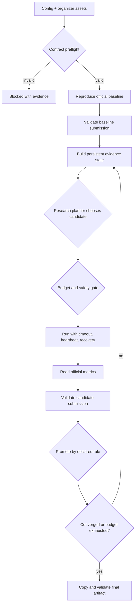

# Autonomous ML Research Agent Product

## What is working

The repository now contains an executable control plane for autonomous ML research. It validates a benchmark contract, reproduces an immutable reference baseline, chooses evidence-backed experiments from an approved catalog, runs them under hard budgets, validates predictions, promotes an incumbent, tracks convergence, survives interruption, and designates one final artifact.

The control plane is benchmark-agnostic. Benchmark code communicates through commands and result JSON, which keeps the organizer evaluator and baseline outside agent-owned code.

## Quick start

The dependency-free demo proves the workflow without pretending to be the competition benchmark:

```powershell
python -m automl_agent --config configs/demo.json preflight
python -m automl_agent --config configs/demo.json run --run-id demo-001
python -m automl_agent --config configs/demo.json status demo-001
python -m automl_agent --config configs/demo.json report demo-001
python -m automl_agent --config configs/demo.json serve --port 8765
```

Run the regression suite:

```powershell
python -m unittest discover -s tests -v
```

After acquiring the official public KuaiRand-Pure archive, run the real-data integration profile:

```powershell
./scripts/fetch_kuairand_pure.ps1
python -m automl_agent --config configs/kuairand-public-research.json preflight
python -m automl_agent --config configs/kuairand-public-research.json run --run-id kuairand-public-001
```

This profile ranks observed public standard-log impressions per user. It verifies real-data scale and click modeling, but it is not the organizer evaluation protocol.

Artifacts are written below `artifacts/agent_runs/<run-id>/` and include:

- `contract_report.json`
- `state.json`
- append-only `events.jsonl`
- baseline result, logs, submission, and validation logs
- one immutable proposal and terminal record per experiment
- heartbeat and per-attempt process logs
- `final_submission.csv`
- `final_manifest.json`
- generated `report.md`

The dashboard is read-only, binds to `127.0.0.1` by default, refreshes active state automatically, and exposes sanitized JSON endpoints for run lists and run details. It does not expose child-process commands or mutate experiments.

## Product flow



## Benchmark adapter contract

Commands run as argument arrays without a shell. A successful training/evaluation command must write:

```json
{
  "status": "succeeded",
  "metrics": {
    "NDCG@10": 0.0,
    "Recall@50": 0.0
  },
  "official_selection_score": 0.0,
  "resources": {
    "gpu_hours": 0.0,
    "llm_tokens": 0
  }
}
```

If the organizer does not define a combined score, configure one official metric as the selection metric and omit `official_selection_score`. The agent never invents a combination.

## Competition integration

`configs/competition.example.json` is a fail-closed template. It will not pass preflight until the following organizer assets are placed and configured:

- official baseline implementation and reported validation scores;
- official evaluator and selection rule;
- official training and public-validation split;
- official submission schema and validator;
- an approved experiment catalog whose commands invoke competition model code.

Do not point this template at the legacy `long_view`/GAUC/nDCG@5 starter scripts. They implement a different task.

See [competition readiness](competition-readiness.md) for the requirement-by-requirement integration status.

## Verified real-data integration

Run `kuairand-public-001` processed 1,141,112 training rows and 295,497 validation impressions for 25,877 users. The external planner tested three context hypotheses and promoted user-tab affinity:

| Metric | Public reference | Selected model |
|---|---:|---:|
| NDCG@10 | 0.681538 | 0.685589 |
| Recall@50 | 0.897697 | 0.897798 |
| Explicit research selection score | 0.789617 | 0.791694 |

The final artifact passed row-alignment validation, required no manual intervention, used no GPU or LLM tokens, and is explicitly marked non-competition in the benchmark diagnostics.

## Current planners

The default demo uses the external-agent protocol with the deterministic `automl_agent.planner_cli`. The API-backed demo uses `automl_agent.llm_planner_cli`, which sends the sanitized EvidencePack to Gemini 3.7 Flash and requests a structured JSON decision. OpenAI remains supported as an alternate provider. Both planners can only select from the reviewed experiment catalog; neither can supply commands or change metrics, splits, budgets, promotion rules, or hidden-test policy.

The Gemini planner reads `GEMINI_API_KEY` from the ignored root `.env`, reports token usage, and stores only non-thinking response text containing the concise decision rationale. The key is sent in the `x-goog-api-key` header and is never written to run artifacts. If the external planner fails, the configuration either fails closed or records a deterministic catalog fallback.

```dotenv
# .env
GEMINI_API_KEY=your_real_key_here
```

```powershell
python -m automl_agent --config configs/demo-llm.json preflight
python -m automl_agent --config configs/demo-llm.json run --run-id llm-demo-001
```

The offline LLM tests use a local fake Gemini endpoint and captured reasoning fixtures, so regression tests make no external calls and incur no API cost.
