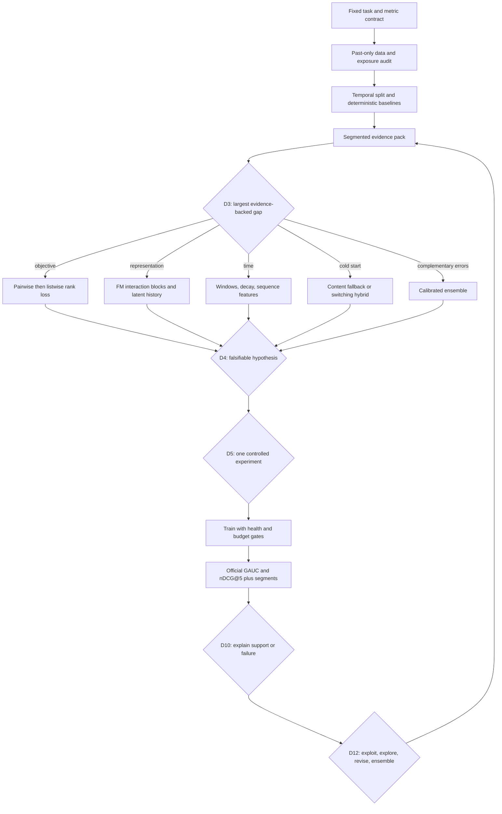

# Recommended ML Flow Improvements

## Recommended flow

## Changes to make in the current agent workflow

### 1. Add a knowledge router before D3

Route the current evidence gap to one to three files from this directory. Store the retrieved `knowledge_id` values in the decision record. Do not inject the entire knowledge base into every prompt.

### 2. Make objective alignment the first high-value branch

Because the benchmark ranks candidates within user, compare pointwise FM against within-user BPR while holding features, split, and capacity constant. Follow with a top-5-aware listwise/LambdaRank experiment. This directly tests the mismatch between training and evaluation.

### 3. Separate feature presence from interaction usefulness

Before rejecting side information, test whether it varies within user and whether the model exposes user × item/context interactions. Maintain explicit FM interaction blocks and remove unsupported pairs rather than enabling every cross.

### 4. Make time a hard data boundary and a model branch

Historical features must be computed strictly before each event. Use temporal validation and compare short, medium, and all-history representations with decay. Only then consider attention or a larger sequence model.

### 5. Add bias and segment evidence to every result

Every EvaluationPacket should include mixed-label users, cold/warm, head/tail, activity, and time/context slices. Include prediction coverage and uncertainty. This prevents D10 from inventing a cause from one aggregate score.

### 6. Gate hybrid complexity on complementary errors

Let D12 propose a blend only after two models show different metric/segment strengths. Start with held-out normalized linear weights; use out-of-fold scores for stacking.

### 7. Keep online methods in a separate future track

Contextual bandits and active label acquisition are useful production ideas, but they do not belong in the current offline promotion path. Randomized exposure can support a separately labeled counterfactual analysis.

## Prioritized experiment ladder

| Priority | Controlled experiment | Expected evidence |
|---|---|---|
| 1 | Pointwise FM → within-user BPR-FM | GAUC gain in mixed-label users |
| 2 | BPR sampling/regularization ladder | Stable pairwise gain, less variance |
| 3 | Listwise/LambdaRank cutoff near 5 | nDCG@5 gain |
| 4 | Explicit FM interaction blocks | Side/context features become rank-useful |
| 5 | Past-only windows and recency decay | Gain in drift/history segments |
| 6 | Cold-start content switch | Cold segment gain without warm regression |
| 7 | Pairwise + top-heavy calibrated blend | Metric tradeoff becomes complementary gain |
| 8 | Auxiliary-feedback multi-task model | Primary gain from shared representation |

## Stop conditions

Reject or revise a proposal when it changes multiple causal variables without an ablation, lacks valid within-user grouping, depends on future outcomes, improves only within uncertainty, or adds complexity without segment/complementarity evidence.
